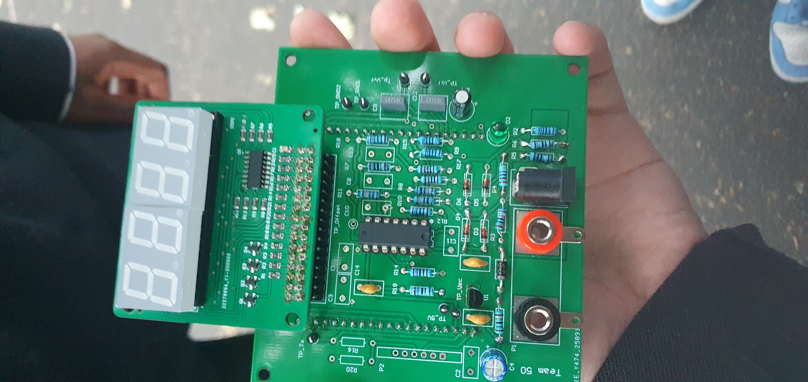
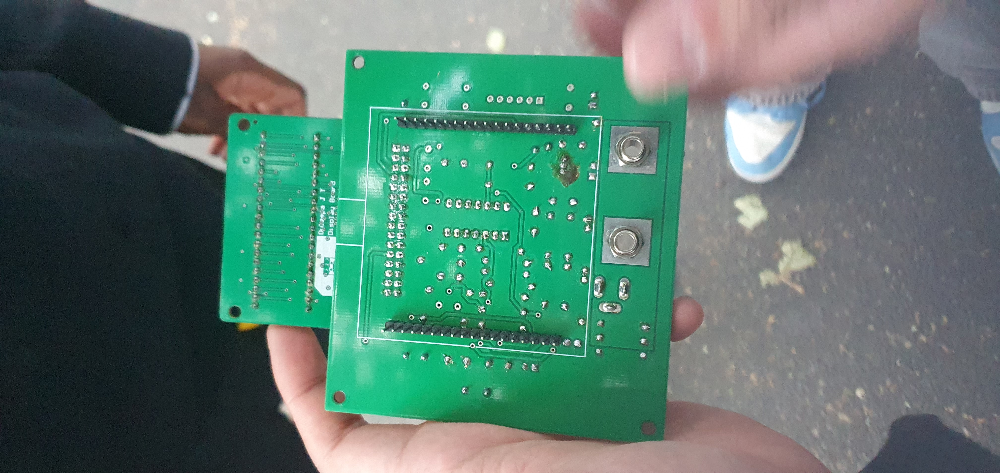
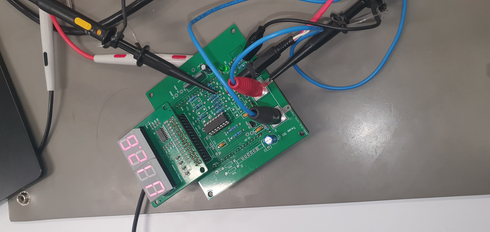
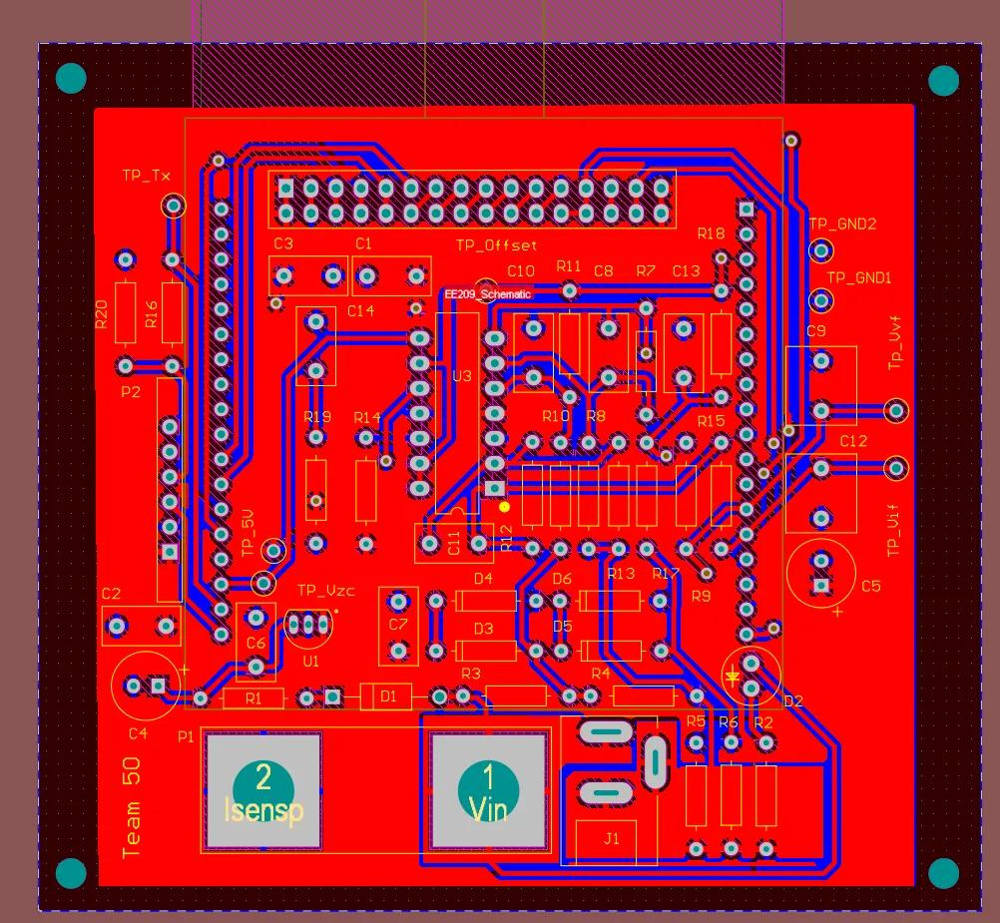
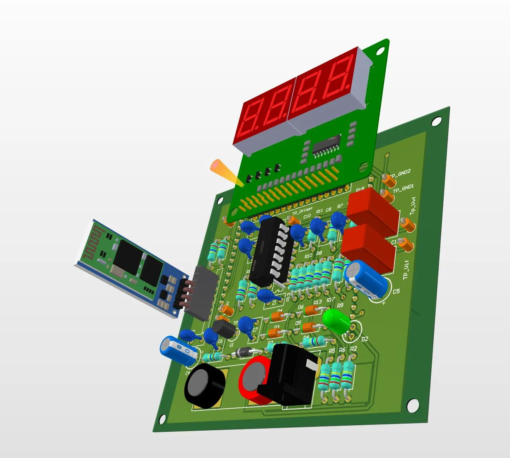
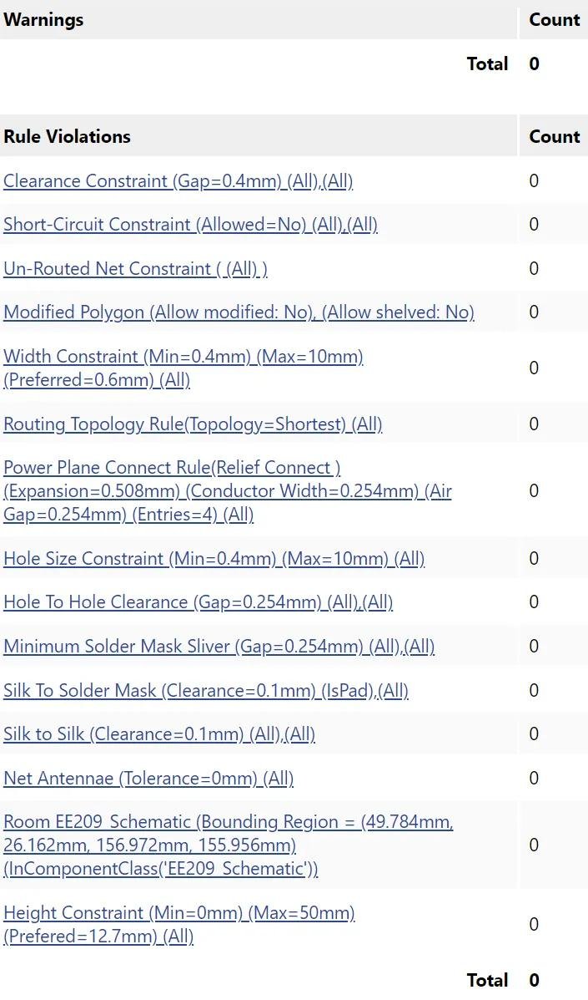
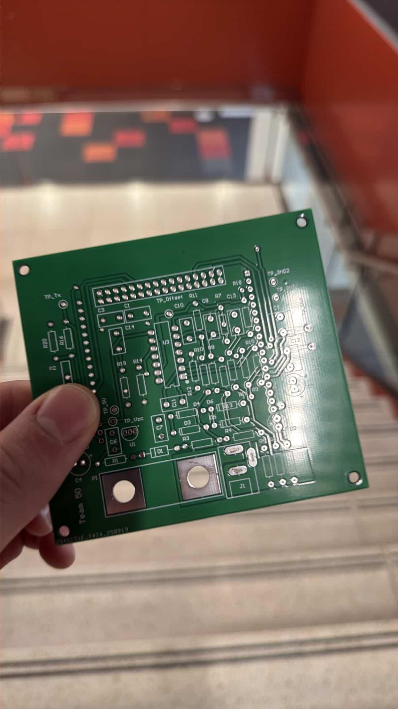
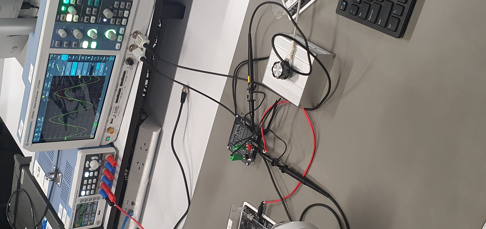
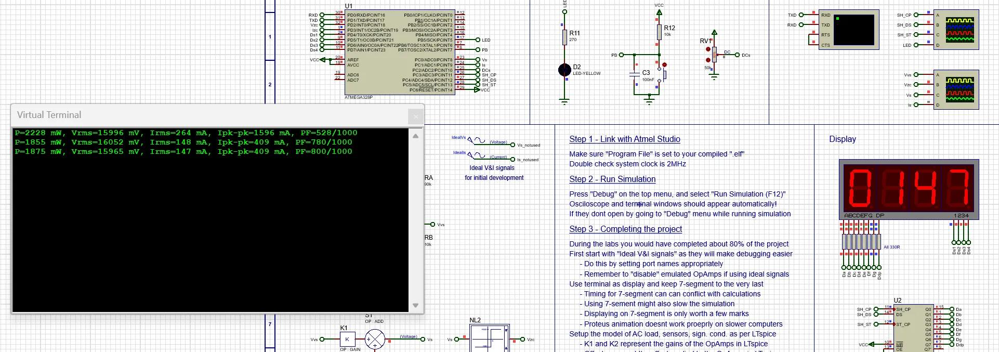

# Smart Energy Monitor

## Credits
Built with (LinkedIn | GitHub):
- Shandrei Claveria [L](https://www.linkedin.com/in/shandrei-claveria-089a47305/) | [G](https://github.com/ssdre1)
- Abdul-Qudus Amidu [L](https://www.linkedin.com/in/abdul-qudus-amidu-41637b2b4/) | [G](https://github.com/nanodecimeter)
- Thomas Vasquez [L](https://www.linkedin.com/in/tomasvazquezt/) | [G](https://github.com/TommoTommoT)

As part of COMPSYS209 at the University of Auckland (2025).

Designed and built a smart energy monitoring system end-to-end — from schematic and PCB layout through to firmware running on an ATmega328P.

<table>
    <tr>
        <td align="center">
         PCB front view</td>
        <td align="center">
         PCB back view</td>
    </tr>
    <tr>
        <td align="center" colspan="2">
         PCB working and probed</td>
    </tr>
</table>

## Overview

For my course, COMPSYS209, I was tasked with my group to create an energy monitoring device for the semester. We were taught how to calculate the metrics, code the firmware, design the PCB, and do testing to make sure it works accurately and reliably.

## How it works

### Circuitry
- Uses an ATmega328P as the MCU to detect a variable load and calculate its average power usage in Watts (W), voltage (V) and current (mA) RMS
- Uses seven-segment displays for output

### Assembly
- Main PCB and the seven-segment display component
- A variable load

## Build process

### Course Learnings

- Learned how to calculate current using a shunt resistor, then derive voltage with a simple voltage divider
- Taught op-amps and how to configure them for amplification, and a comparator with hysteresis for zero detection
- Learned how to operate the ATmega328P's ADC to correctly sample voltage and current analog signals, switching consecutively so the same ADC channel is used for both measurements
- Taught how to calculate and select components for PCB design (using Altium) — different types of capacitors (electrolytic, ceramic, and film) and resistors (wire-wound, film, and potentiometer)

### PCB Design (Altium)

While I'm more familiar with KiCad, the course had us learn Altium instead, which is more industry-standard PCB design software.

<table>
    <tr>
        <td align="center">
         A layer of traces</td>
        <td align="center">
         Render of completed PCB with all components installed</td>
    </tr>
    <tr>
        <td align="center">
         Violations — continuing to refine</td>
        <td align="center">
         Bare PCB</td>
    </tr>
</table>

### Testing

We were also introduced to Putty, Proteus, and Microchip Studio. Lots of debugging in firmware via Microchip Studio, simulations in Proteus, and hardware testing with Putty and oscilloscopes to make sure the monitor was working properly and accurately.

<table>
    <tr>
        <td align="center">
         Monitoring how the variable load works</td>
        <td align="center">
         Simulating in Proteus</td>
    </tr>
    <tr>
        <td align="center">
         Validating firmware and adjusting values according to calculations</td>
        <td align="center">
         Testing with Putty and oscilloscope</td>
    </tr>
    <tr>
        <td align="center" colspan="2">
         Seven-segment display showing the right values</td>
    </tr>
    <tr>
        <td align="center" colspan="2">
         Workspace in Proteus</td>
    </tr>
</table>